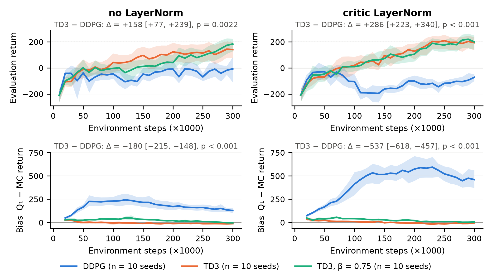
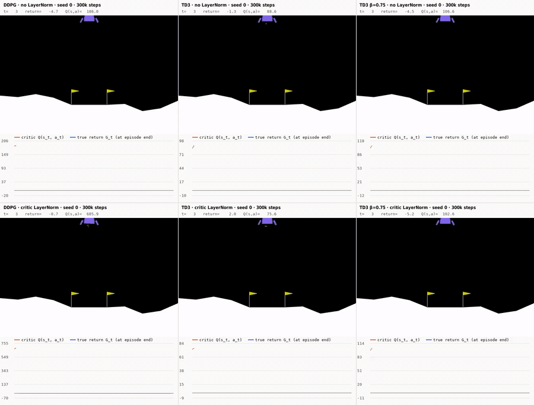
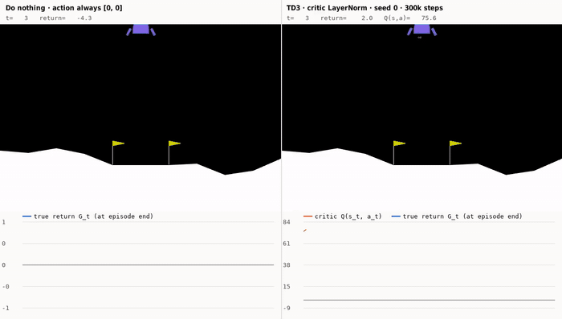
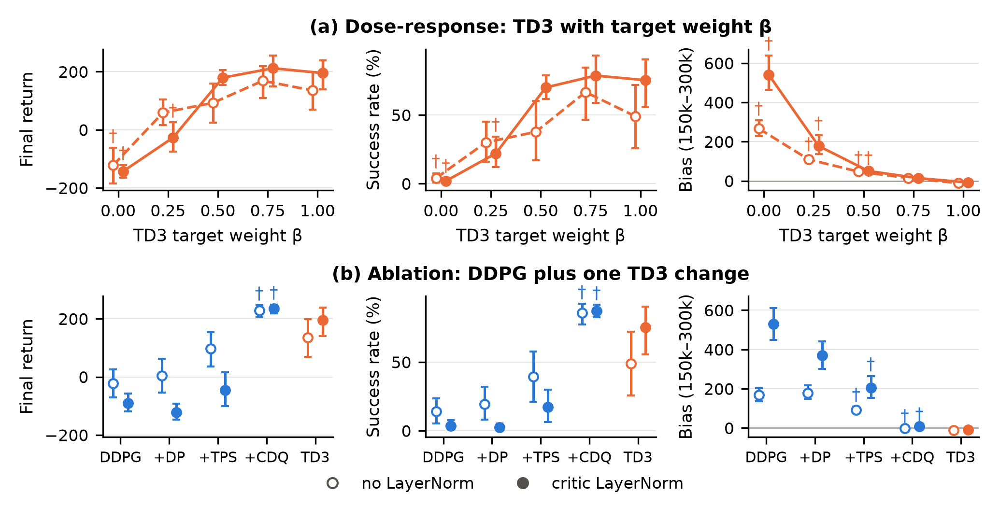
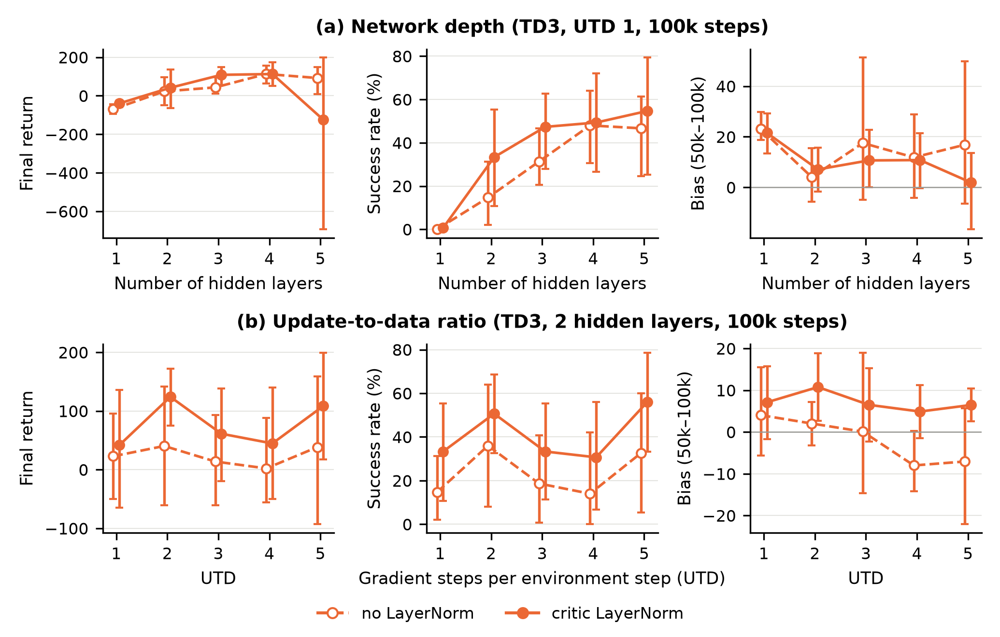
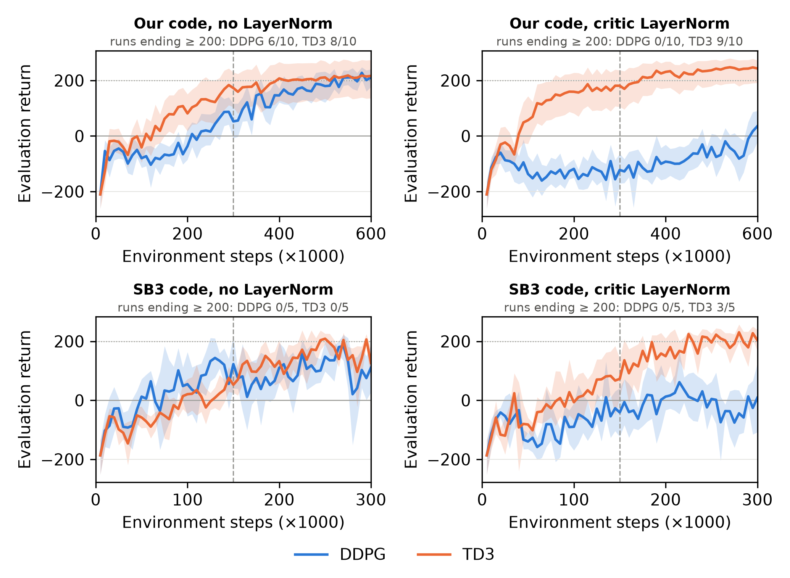

# Overestimation bias of DDPG and TD3 on LunarLander, with and without LayerNorm

Mini-project 1 of the Reinforcement Learning course (Master DAC, Sorbonne Université, 2026).
This is a preliminary version: the report is not included yet.

**Questions.** Does TD3 reduce the overestimation bias of DDPG on `LunarLanderContinuous-v3`,
in the standard setting and with layer normalization in the critics? Does a reduction of the
bias affect performance?



*Evaluation return (top) and overestimation bias Q₁ − G (bottom), without (left) and with (right)
LayerNorm in the critics; mean over 10 seeds, shaded: 95% bootstrap CI.*

## Simulations

The six agents of seed 0 after 300k steps, flying the same episodes: DDPG, TD3 and TD3 with
β = 0.75 (columns), without (top) and with (bottom) LayerNorm in the critics. Below each lander,
the critic's estimate Q₁(s_t, a_t) during the episode (orange) and, once the episode is over,
the true discounted return G_t (blue): the gap between the two curves is the overestimation
that the study measures.



An agent that never fires its engines (action always [0, 0]) next to TD3 with LayerNorm:



Full videos with three landings each: [`media/landings_6_agents.mp4`](media/landings_6_agents.mp4),
[`media/do_nothing_vs_td3.mp4`](media/do_nothing_vs_td3.mp4). These are single runs, shown for
illustration; the conclusions of the study rest on 10 seeds per condition.

To watch the agents live (keys: space = pause, n = next episode, q = quit):

```bash
python watch.py agents/ddpg_ln00_L2_utd1_pd1_s0.pt agents/td3_ln00_L2_utd1_pd2_s0.pt \
                agents/td3_ln00_L2_utd1_pd2_b0.75_s0.pt agents/ddpg_ln10_L2_utd1_pd1_s0.pt \
                agents/td3_ln10_L2_utd1_pd2_s0.pt agents/td3_ln10_L2_utd1_pd2_b0.75_s0.pt --cols 3
python watch.py noop agents/td3_ln10_L2_utd1_pd2_s0.pt         # do-nothing baseline
python qgrid.py agents/*.pt                                     # Q-value heatmaps of the critics
```

## Additional experiments

Specified in [`ANALYSIS_PLAN.md`](ANALYSIS_PLAN.md) before they were computed, and reported as
exploratory: (a) a dose-response on the target weight, TD3 with β ∈ {0, 0.25, 0.5, 0.75, 1}
(β = 1 is standard TD3, a smaller β a less pessimistic target); (b) an ablation adding a single
TD3 change to DDPG: delayed actor and target updates (+DP), target policy smoothing (+TPS) or twin
critics with the min target (+CDQ). Each with and without LayerNorm, 10 seeds (120 runs in
`runs/dose` and `runs/ablation`).



*Mean over 10 seeds with 95% bootstrap CI; hollow: no LayerNorm, filled: LayerNorm in the critics.
†: different from the reference (standard TD3 in (a), tested for β ≤ 0.5; DDPG in (b)) after a
Holm correction over the 18 Welch tests of each row. All numbers, including the two planned analyses
of the main runs: [`figs_extra/extra_stats.txt`](figs_extra/extra_stats.txt).*

Two later experiments, also planned in `ANALYSIS_PLAN.md` before they were run (sections E–G):
(c) TD3 with 1–5 hidden layers or 1–5 gradient steps per environment step (UTD), with and without
LayerNorm, 5 seeds, 100k steps (80 runs in `runs/depth` and `runs/utd`); (d) DDPG and TD3, with and
without LayerNorm, 10 seeds, 600k steps (40 runs in `runs/long`).



*Depth and UTD of TD3 after 100k steps (5 seeds; † would mark a difference from the default after a
Holm correction, none survives). Numbers: [`figs_extra/extra_stats.txt`](figs_extra/extra_stats.txt).*



*Top: our code with 600k steps (10 seeds); bottom: the Stable-Baselines3 replication with 300k steps
(5 seeds); dashed line: half of the training. Without LayerNorm, DDPG catches up with TD3 at 600k
steps (213 vs. 216); with LayerNorm it does not (14 vs. 244). Numbers:
[`figs_extra/long_stats.txt`](figs_extra/long_stats.txt).*

## Replication with Stable-Baselines3

[`mp-sb3/`](mp-sb3) repeats the main design (DDPG / TD3 × critic LayerNorm, seeds 0–4) with the DDPG
and TD3 of Stable-Baselines3 2.9 and that code base's settings (γ = 0.98, learning rate 10⁻³,
τ = 0.01, 100k buffer, 5k warm-up steps): with its default 150k steps (`mp-sb3/results`, plus TD3
with 1 or 5 critics in the min target) and with the 300k steps of our runs (`mp-sb3/results_300k`,
whose first 150k steps are identical to the 150k runs). Its own figures (150k) are in
[`mp-sb3/figures`](mp-sb3/figures); the statistics in the report (the comparisons of the main table,
Holm correction over their 15 tests) come from `analyze_sb3.py`:
[`figs_extra/sb3_300k_stats.txt`](figs_extra/sb3_300k_stats.txt) and
[`figs_extra/sb3_stats.txt`](figs_extra/sb3_stats.txt) (150k).

## Method in short

- **Algorithms** (`td3.py`): one PyTorch file, so that DDPG and TD3 differ only by TD3's three
  changes (twin critics with a min target, target policy smoothing, delayed actor updates).
  DDPG is the "OurDDPG" variant of Fujimoto et al. (2018). Each change can also be switched on
  alone (`--twin`, `--smooth`, `--policy-delay`), and `--beta` replaces TD3's min target by
  `beta * min + (1 - beta) * max` of the two critics.
- **LayerNorm** (`--critic-ln 1`): `Linear -> LayerNorm -> ReLU` in every hidden layer of the critics.
- **Overestimation bias**: every 10k steps, 10 episodes of the deterministic policy; for every visited
  (s, a), the critic's Q₁(s, a) is compared with the discounted Monte Carlo return G of that episode.
  States in the last 500 steps of time-limit episodes are discarded (their return is truncated).
- **Statistics** (`analyze.py`): 10 seeds per condition; final return = mean of the last 3 evaluations,
  bias = mean over 150k–300k steps; Welch's t-tests and bootstrap CIs on differences, Holm correction.
- **Additional analyses** (`analyze_extra.py`), specified in [`ANALYSIS_PLAN.md`](ANALYSIS_PLAN.md)
  before they were computed: timing of bias vs improvement, within-condition association,
  dose-response on `beta`, and an ablation of TD3's three changes.

All hyper-parameters (Fujimoto et al. 2018 defaults, not tuned per condition): 300k steps, 10k random
warm-up steps, batch 256, Adam with learning rate 3e-4, γ = 0.99, τ = 0.005, two hidden layers of 256,
exploration noise N(0, 0.1²), TD3 smoothing noise 0.2 clipped at 0.5, one gradient step per environment step.

## Files

| File | Content |
|---|---|
| `td3.py` | DDPG / TD3 training with bias measurement; writes one JSON log per run |
| `launch.sh` | main grid: algorithm × critic LayerNorm × seeds 0–9 |
| `run_jobs.sh`, `jobs_extra.txt` | runner and job list of the additional experiments |
| `analyze.py` | figures, statistics and LaTeX results table of the main study |
| `analyze_extra.py`, `ANALYSIS_PLAN.md` | additional analyses and their plan |
| `td3_notebook.ipynb` | the TD3 part of `td3.py` as a commented notebook |
| `watch.py` | live simulation of saved agents, with the critic's estimate vs the true return |
| `qgrid.py` | heatmaps of the critics' Q-values over actions and positions |
| `agents/` | the six seed-0 agents (actor and critics) after 300k steps |
| `media/` | recorded simulations (GIF for this page, MP4 with three landings) |
| `runs/core`, `runs/beta075` | JSON logs of the 60 main runs (config + every evaluation) |
| `runs/dose`, `runs/ablation` | JSON logs of the 120 runs of the additional experiments |
| `figs_extra` | figures, LaTeX tables and statistics of the additional analyses |
| `mp-sb3/` | Stable-Baselines3 replication: code, per-run CSV/JSON logs, figures |
| `analyze_sb3.py` | statistics of the Stable-Baselines3 replication |
| `runs/depth`, `runs/utd`, `runs/long` | JSON logs of the depth / UTD runs (80) and of the 600k-step runs (40) |
| `jobs_depth_utd.txt`, `jobs_long.txt` | job lists of these runs (for `run_jobs.sh`) |
| `analyze_long.py` | longer-training analysis (our 600k runs and SB3 at 300k) |
| `report/figs` | generated figures, results table and statistics |

## Reproduce

```bash
uv venv --python 3.12 .venv && source .venv/bin/activate
uv pip install swig
uv pip install torch==2.14.1 --index-url https://download.pytorch.org/whl/cpu
uv pip install "gymnasium[box2d]==1.4.0" numpy scipy matplotlib pygame-ce

python td3.py --algo td3 --critic-ln 1 --seed 0 --out runs/test      # one run (30-60 min on one CPU core)
./launch.sh runs/core 18                                               # main grid, 40 runs
ALGOS=td3 ./launch.sh runs/beta075 20 --beta 0.75                      # TD3 with beta = 0.75
./run_jobs.sh jobs_extra.txt 20                                        # dose-response and ablation runs
python analyze.py runs/core runs/beta075 --out report/figs             # figures and statistics
python analyze_extra.py                                                # additional analyses
python td3.py --algo td3 --seed 0 --save-ckpt 1 --out runs/showcase    # save new agents, then:
python watch.py runs/showcase/*.pt                                     # watch them land
python analyze_sb3.py mp-sb3/results/core                              # statistics of the SB3 replication
./run_jobs.sh jobs_depth_utd.txt 20                                    # depth and UTD runs (100k steps)
./run_jobs.sh jobs_long.txt 20                                         # 600k-step runs
python analyze_long.py                                                 # longer training (+ SB3 at 300k)
python analyze_sb3.py mp-sb3/results_300k/core                         # SB3 replication at 300k steps
```

The Stable-Baselines3 replication has its own environment (see [`mp-sb3/README.md`](mp-sb3/README.md)).

With the same seed and library versions, a run is reproduced bit for bit on the same machine;
on another CPU, floating-point differences make it diverge (an equally valid, not identical, run).
The runs of the report used Python 3.12, PyTorch 2.14.1 (CPU), Gymnasium 1.4.0 and NumPy 2.5.3.

## References

- Fujimoto, van Hoof, Meger (2018). Addressing Function Approximation Error in Actor-Critic Methods. ICML.
- Lillicrap et al. (2016). Continuous control with deep reinforcement learning. ICLR.
- Ba, Kiros, Hinton (2016). Layer Normalization. arXiv:1607.06450.
- Colas, Sigaud, Oudeyer (2019). A Hitchhiker's Guide to Statistical Comparisons of Reinforcement Learning Algorithms. arXiv:1904.06979.
